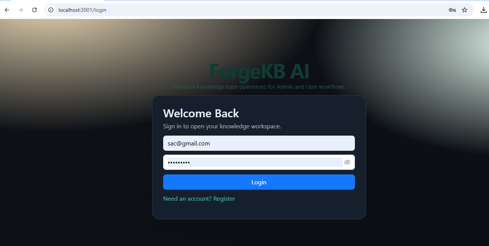
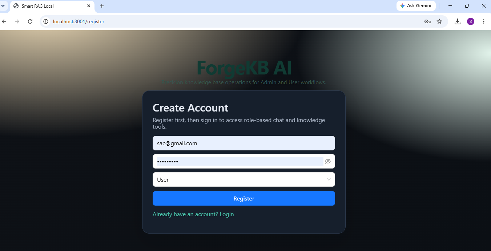
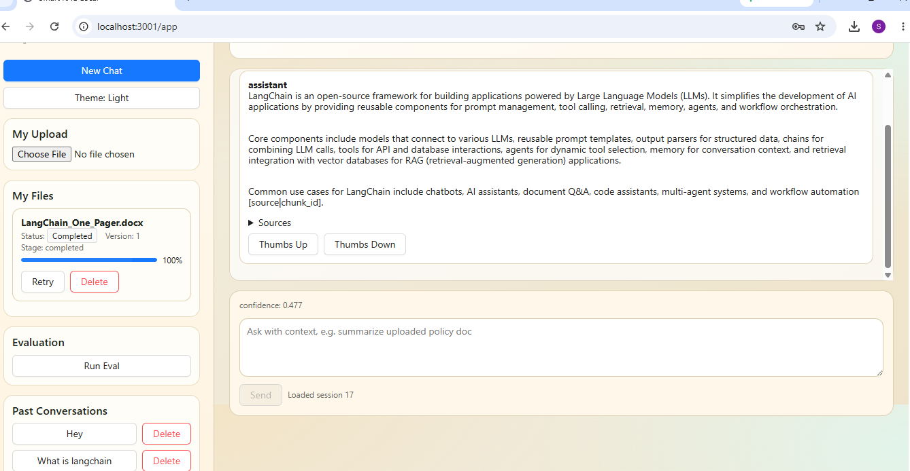
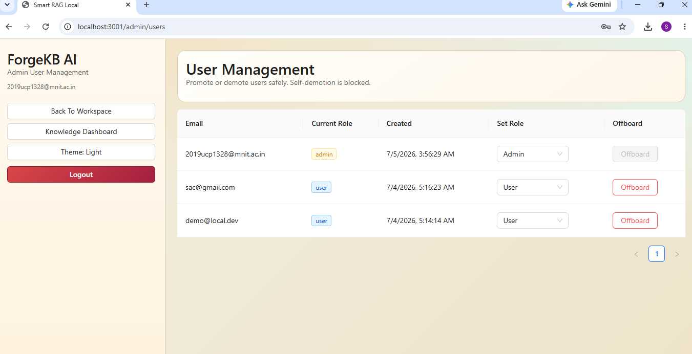
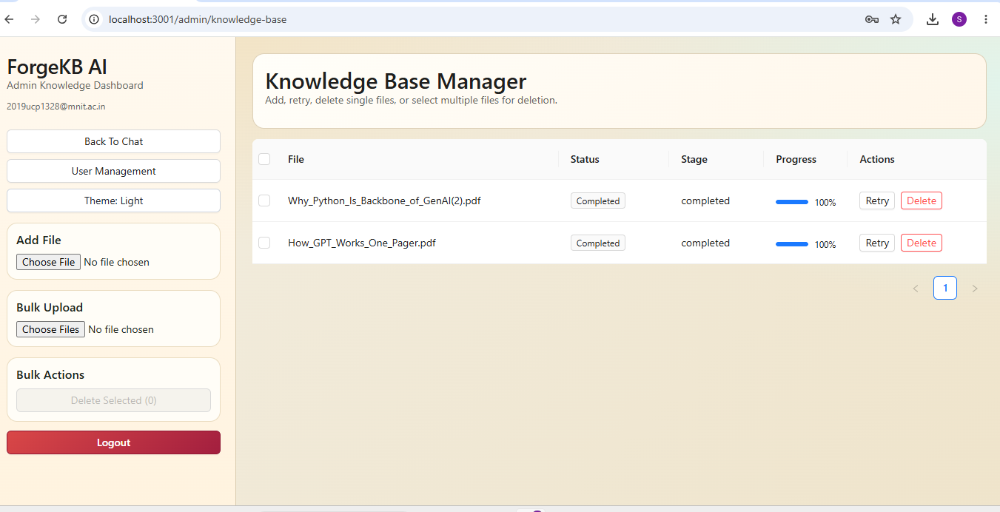

# ForgeKB AI - Agentic RAG System

>An AI-powered, role-aware RAG platform that combines FastAPI, LangGraph, LangChain, and Celery to deliver grounded, traceable answers from knowledge base.


## Overview

ForgeKB AI is an end-to-end Agentic AI + RAG system built for production-style retrieval workflows.
It supports role-based data visibility, async ingestion with telemetry, hybrid retrieval, and streaming responses with citations/confidence signals.

This project demonstrates practical applied GenAI engineering:

- Multi-step retrieval orchestration with LangGraph
- Tooling-powered retrieval/generation with LangChain
- Hybrid search (FAISS semantic + BM25 keyword fusion)
- Async ingestion and re-indexing with Celery + Redis
- Role-aware access control (admin global knowledge, user private knowledge)
- End-to-end full-stack delivery with React dashboards

### Key Features

- **Agentic Retrieval Flow**: Query analysis, routing strategy, and contextual retrieval before generation
- **Hybrid Search Pipeline**: FAISS + BM25 fusion with optional cross-encoder reranking
- **Grounded Answers**: Citation-aware responses with confidence metadata
- **Streaming UX**: SSE token stream plus structured events (`session`, `token`, `confidence`, `citations`, `done`)
- **Asynchronous Ingestion**: Background indexing tasks with progress/stage telemetry
- **Role-Based Governance**: Visibility-aware retrieval and file operations for admin/user scopes
- **Evaluation Endpoint**: Built-in evaluation route backed by dataset configuration

## Architecture

### Technology Stack

#### Frontend
- **React 18 + Vite 5** - SPA frontend with fast development and build tooling
- **React Router 6** - Client-side navigation
- **TanStack Query** - Async API state management
- **Zustand** - Lightweight client state management
- **Ant Design** - UI component system

#### Backend
- **FastAPI** - High-performance Python API framework
- **LangGraph** - Agentic state-based orchestration
- **LangChain** - LLM and retrieval integration
- **Celery + Redis** - Async task queue for ingestion/re-indexing
- **MySQL + SQLAlchemy** - Application persistence layer
- **FAISS + sentence-transformers + rank-bm25** - Retrieval and ranking stack
- **LangSmith-ready tracing hooks** - Optional LLM observability integration

### System Architecture

```text
┌─────────────┐
│ React + Vite│ ← User Interface
│  Frontend   │
└──────┬──────┘
		 │ HTTP/SSE
		 ▼
┌─────────────────────────────────────┐
│         FastAPI Backend             │
│  ┌─────────────────────────────┐   │
│  │   LangGraph Orchestrator    │   │
│  │  ┌─────────────────────┐    │   │
│  │  │ Query Analysis Node │    │   │
│  │  │ Retrieval Node      │    │   │
│  │  │ Chat Service (LLM)  │    │   │
│  │  └─────────────────────┘    │   │
│  └─────────────────────────────┘   │
│                                      │
│  ┌──────────┐  ┌──────────┐        │
│  │ Celery   │  │   Redis  │        │
│  │ Workers  │  │  Broker  │        │
│  └──────────┘  └──────────┘        │
└─────────────────────────────────────┘
			│
			▼
┌─────────────────┐
│      MySQL      │ ← Users, sessions, docs, audit, feedback
│   + FAISS Disk  │ ← Vector index + chunk manifest
└─────────────────┘
```

## Project Structure

```text
ForgeKB AI - Agentic RAG System/
├── backend/
│   ├── app/
│   │   ├── api/routes/         # Auth, chat, history, admin, ingestion, eval
│   │   ├── core/               # App settings and security utilities
│   │   ├── db/                 # SQLAlchemy models and DB session
│   │   ├── services/rag/       # Graph, retrieval, ingestion, guardrails
│   │   ├── tasks.py            # Celery ingestion task
│   │   ├── worker.py           # Celery app config
│   │   └── main.py             # FastAPI entrypoint
│   ├── .env.example
│   ├── requirements.txt
│   └── Dockerfile
├── frontend/
│   ├── src/pages/              # Login, register, app and admin pages
│   ├── lib/api.ts              # Typed frontend API client
│   ├── package.json
│   └── Dockerfile
├── data/
│   ├── faiss/                  # index.faiss + chunks_manifest.json
│   └── uploads/                # admin and user uploaded documents
├── eval/
│   └── eval_dataset.json
├── docker-compose.yml
└── README.md
```

## Skills Demonstrated

ATS keywords: Generative AI, Agentic AI, RAG, LangChain, LangGraph, Prompt Engineering, Retrieval Engineering, FAISS, BM25, FastAPI, Python, Celery, Redis, SQLAlchemy, MySQL, SSE Streaming, Observability, Role-Based Access Control, React, TypeScript, Docker Compose.

## Product Screenshots

### Login


### Signup


### User Dashboard


### Admin User Management


### Admin Knowledge Base Management


## Quick Start

### Prerequisites

- **Node.js 18+** (frontend)
- **Python 3.11+** (backend)
- **Docker & Docker Compose** (recommended)
- **Git** (optional, for development workflows)

### Option 1: Docker Compose (Recommended)

1. **Clone the repository**
	```bash
	git clone <your-repo-url>
	cd "ForgeKB AI - Agentic RAG System"
	```

2. **Set up environment variables**
	```bash
	cp backend/.env.example backend/.env
	# Edit backend/.env and add OPENAI_API_KEY (and optional LangSmith keys)
	```

3. **Start all services**
	```bash
	docker compose up -d --build
	```

4. **Access the application**
	- Frontend: http://localhost:3001
	- Frontend Login: http://localhost:3001/login
	- Frontend Workspace: http://localhost:3001/workspace
	- Admin Knowledge Base: http://localhost:3001/admin/knowledge-base
	- Backend API Health: http://localhost:8001/api/health
	- API Docs: http://localhost:8001/docs

### Option 2: Manual Setup

#### Backend Setup

```bash
# from repository root
python -m venv .venv

# Linux/macOS
source .venv/bin/activate

# Windows PowerShell
.venv\Scripts\Activate.ps1

pip install -r requirements.txt
cp backend/.env.example backend/.env

cd backend
uvicorn app.main:app --reload --host 0.0.0.0 --port 8000
```

Start Celery worker in a second terminal:

```bash
cd backend
celery -A app.worker.celery_app worker -Q ingestion --loglevel=info
```

#### Frontend Setup

```bash
cd frontend
npm install

# optional: override API base if not using docker defaults
# set VITE_API_BASE=http://localhost:8000/api

npm run dev
```

#### Start Redis and MySQL (if not using Docker Compose)

```bash
docker run -d -p 6380:6379 redis:7-alpine
docker run -d -p 3307:3306 \
  -e MYSQL_ROOT_PASSWORD=root_password \
  -e MYSQL_DATABASE=rag_db \
  -e MYSQL_USER=rag_user \
  -e MYSQL_PASSWORD=rag_password \
  mysql:8.4
```

If running backend locally, update `backend/.env` host/port values to match your local services.

## Usage

### 1. Register an Account
Open the frontend and create a user account from the signup page.

### 2. Sign In and Start Chatting
Sign in at `http://localhost:3001/login`, then use `http://localhost:3001/workspace` to ask questions against indexed knowledge.

### 3. Upload Knowledge Sources
- User role: upload personal/private documents
- Admin role: upload global documents, including bulk upload support

### 4. Monitor Ingestion Progress
Track datasource status fields (`Pending`, `Indexing`, `Completed`, `Failed`) and progress telemetry.

### 5. Review Retrieval Results
Use SSE chat mode to receive token stream plus confidence and citation events.

## Configuration

### Backend Environment Variables (`backend/.env`)

```env
JWT_SECRET=change_me
OPENAI_API_KEY=
OPENAI_MODEL=gpt-4o-mini

MYSQL_USER=rag_user
MYSQL_PASSWORD=rag_password
MYSQL_HOST=mysql
MYSQL_PORT=3306
MYSQL_DB=rag_db

UPLOADS_DIR=/workspace/data/uploads
FAISS_DIR=/workspace/data/faiss
METADATA_STORE_PATH=/workspace/data/faiss/chunks_manifest.json
EVAL_DATASET_PATH=/workspace/eval/eval_dataset.json

REDIS_URL=redis://redis:6379/0
CORS_ORIGINS=http://localhost:3000,http://localhost:3001

LANGCHAIN_TRACING_V2=true
LANGCHAIN_API_KEY=
LANGCHAIN_PROJECT=smart-rag-local
OTEL_ENABLED=false
```

### Frontend Environment Variables

```env
VITE_API_BASE=http://localhost:8001/api
```

## Quality Checks

### Frontend
```bash
cd frontend
npm run build
```

### Backend Import Check
```bash
cd backend
python -c "import app.main; print('Backend import check passed')"
```

## Troubleshooting

- **401 Unauthorized on `/api/auth/me` or `/api/history/sessions`**
	- Your stored token is likely expired/invalid. Log out and sign in again.
	- If needed, clear browser storage for `localhost:3001` and retry.

- **Frontend not loading after code changes**
	- Restart frontend container:
		```bash
		docker compose restart frontend
		```
	- Hard refresh browser (`Ctrl+F5`).

- **`favicon.ico` 404 in browser console**
	- This is non-blocking and does not affect app functionality.

## API Surface (Highlights)

- Health: `GET /api/health`
- Auth: `POST /api/auth/register`, `POST /api/auth/login`, `GET /api/auth/me`, `POST /api/auth/logout`
- Chat: `POST /api/chat`, `POST /api/chat/stream`
- History: `GET /api/history/sessions`, `GET /api/history/sessions/{session_id}`, `DELETE /api/history/sessions/{session_id}`
- Conversations: `GET /api/conversations`
- Datasources: `GET /api/datasources`, `POST /api/datasources/upload`, `POST /api/datasources/upload/bulk`, `DELETE /api/datasources/{datasource_id}`, `POST /api/datasources/retry`, `GET /api/datasources/tasks/{task_id}`
- Ingestion: `POST /api/ingest/upload`, `POST /api/ingest/run`
- Admin: `GET /api/admin/users`, `PATCH /api/admin/users/{user_id}/role`, `DELETE /api/admin/users/{user_id}`
- Feedback: `POST /api/feedback`
- Evaluation: `GET /api/eval/run`

## RAG Pipeline Capabilities

### Ingestion
- Multi-format loading: txt, md/markdown, pdf, docx
- Recursive chunking with overlap
- Incremental index updates and full rebuild fallback
- Manifest persistence for documents/chunks and metadata

### Retrieval
- Query routing strategy (factual / analytical / balanced)
- Query expansion using OpenAI model (when configured)
- Hybrid semantic + keyword ranking with weighted fusion
- Parent-context enrichment and confidence scoring
- Optional cross-encoder reranking for final ordering

### Response Generation
- Grounded answer synthesis from retrieved contexts
- Citation metadata support
- SSE event streaming for interactive chat UX

## Acknowledgments

- **LangChain** - LLM and retrieval building blocks
- **LangGraph** - Agentic orchestration primitives
- **FastAPI** - Backend framework
- **React + Vite** - Frontend framework and tooling
- **FAISS** - Local vector search engine
